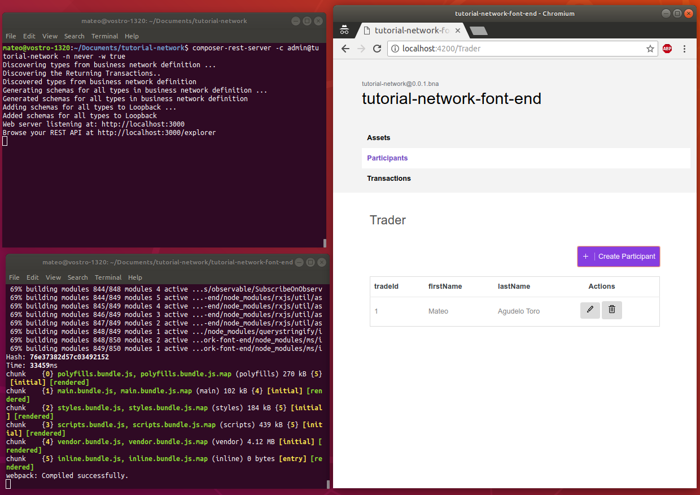

# Hyperledger Demo
Here we demonstrate the usage of tools from the Hyperledger project in building a blockchain-based energy trading system. It consists of a back end running on a blockchain (Hyperledger Fabric) and exposed through a REST API, and a blockchain manager written using Angular that is an example of front end. Here's what it kind of looks like:




### Pre-requisites
The blockchain is specified using Hyperledger Composer and the deployment runs on Hyperledger Fabric. The following are the tools and versions required, both the ones listed by the [official documentation](https://hyperledger.github.io/composer/latest/installing/installing-prereqs.html) and the used ones:

|                | Official                        | Personal                  |
|----------------|---------------------------------|---------------------------|
| Ubuntu         | 14.04 or 16.04 (both 64-bit)    | 18.04 (64-bit)            |
| Docker         | 17.03 or higher                 | 18.06.0-ce, build 0ffa825 |
| Docker Compose | 1.8 or higher                   | 1.17.1                    |
| Node           | 8.9 or higher (9 not supported) | 8.11.4                    |
| NPM            | 5.x                             | 5.6.0                     |
| Git            | 2.8.x or higher                 | 2.17.1                    |
| Python         | 2.7.x                           | 2.7.15rc1                 |
| Editor         | VSCode                          | VSCode                    |

**Note:** all the dependencies must *not* require root access to run (note that this is common for Docker and NPM to name some).


### Development tools
Like we already mentioned, we need (mainly) Hyperledger Composer and Fabric. The [official documentation](https://hyperledger.github.io/composer/latest/installing/development-tools.html) suggests some additional tools. Here's the full list:

##### Hyperledger Composer
- Composer CLI v0.20
- Composer REST Server v0.20
- Generator Hyperledger Composer v0.20
- Yeoman (latest version)
- Composer Playground v0.20

##### Hyperledger Fabric
The suggested installation directory is `~/fabric-dev-servers`. If you agree, it's Fabric can be installed by just running the following commands that just download it into the specified directory:

```
$ mkdir -p ~/fabric-dev-servers
$ cd ~/fabric-dev-servers
$ curl -O https://raw.githubusercontent.com/hyperledger/composer-tools/master/packages/fabric-dev-servers/fabric-dev-servers.tar.gz
$ tar -xvf fabric-dev-servers.tar.gz
$ export FABRIC_VERSION=hlfv12
$ ./downloadFabric.sh
```

##### (Optional) VSCode Extention

Install the `Hyperldedger Composer` extension for VSCode. It really helps a lot.


### Usage
The first time to start up a new runtime it's required to run the start script and then generate a PeerAdmin card:

```
$ cd ~/fabric-dev-servers
$ export FABRIC_VERSION=hlfv12
$ ./startFabric.sh
$ ./createPeerAdminCard.sh
```

After this we can:

##### Start the runtime

```
~/fabric-dev-servers/startFabric.sh
```

##### Stop the runtime

```
~/fabric-dev-servers/stopFabric.sh
```

##### Teardown the runtime

Notice that this will require you to generate a PeerAdmin card again the next time you want to use a newly started runtime

```
~/fabric-dev-servers/teardownFabric.sh
```

### Sample Business Network deployed on Blockchain

At this point everything is set and we can use Hyperledger Composer to create and deploy our tailored blockchain on Hyperledger Fabric. The official documentation has an [excellent tutorial](https://hyperledger.github.io/composer/latest/tutorials/developer-tutorial.html) on this and is the one we followed.
